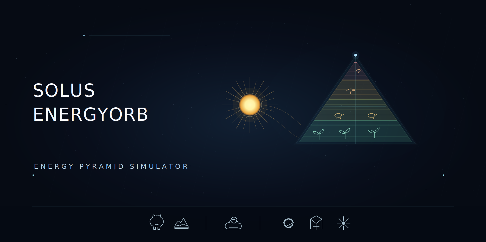

  

# ☀️ Solus EnergyOrb

### *Energy Pyramid Simulator*

> **Solus EnergyOrb** is an interactive visualization exploring **energy flow, trophic levels, heat loss, biomass transfer, and nutrient cycling** within an ecosystem.
>
🌱 **Ecosystem** · ☀️ **Energy Flow** · 🔬 **Trophic Levels**

**🔬 [Explore the Simulation](YOUR_CLOUDFLARE_LINK_HERE)**

---

## ✦ Features

**☀️ Solar Energy Input**  
Activate the Sun to visualize **PAR (Photosynthetically Active Radiation)** reaching producers and initiating energy flow through the ecosystem.

**🔺 Trophic-Level Visualization**  
Explore energy transfer across **four trophic levels (TL1–TL4)** through an interactive energy pyramid.

**⚡ Energy Transfer & Loss**  
Follow energy as it moves upward through trophic levels, with progressively less energy available at each stage.

**🔥 Heat & Biomass Tracking**  
Switch between **Energy, Heat, and Biomass** views to visualize how these quantities change across trophic levels.

**♻️ Detritus & Nutrient Cycling**  
Explore how waste and dead organic matter move towards decomposers, while nutrients return to producers.

**🧭 Guided Energy-Flow Walkthrough**  
A seven-step interactive sequence demonstrates how energy and matter move through the ecosystem.

**🎴 Interactive Learning Interface**  
A focused dark interface combines ecosystem geometry, organism cards, animated energy pathways, and real-time measurements.

---

## 🌱 Core Concepts

**Ecosystem · Producers · Consumers · Trophic Levels · Energy Flow · PAR · Heat Loss · Biomass · Decomposers · Detritus · Nutrient Cycling · Energy Pyramid**

---

## ⚙️ Technology

**HTML · CSS · JavaScript**

**Repository:** GitHub & Codeberg  
**Hosting:** Cloudflare  
**Code Architecture:** Perplexity Sonar 2  
**Code Refinement:** OpenAI GPT-5.6  
**Code Implementation:** Claude Opus 4.8

---

## 📜 License

Distributed under the **GNU General Public License v3.0 (GPL-3.0)**.